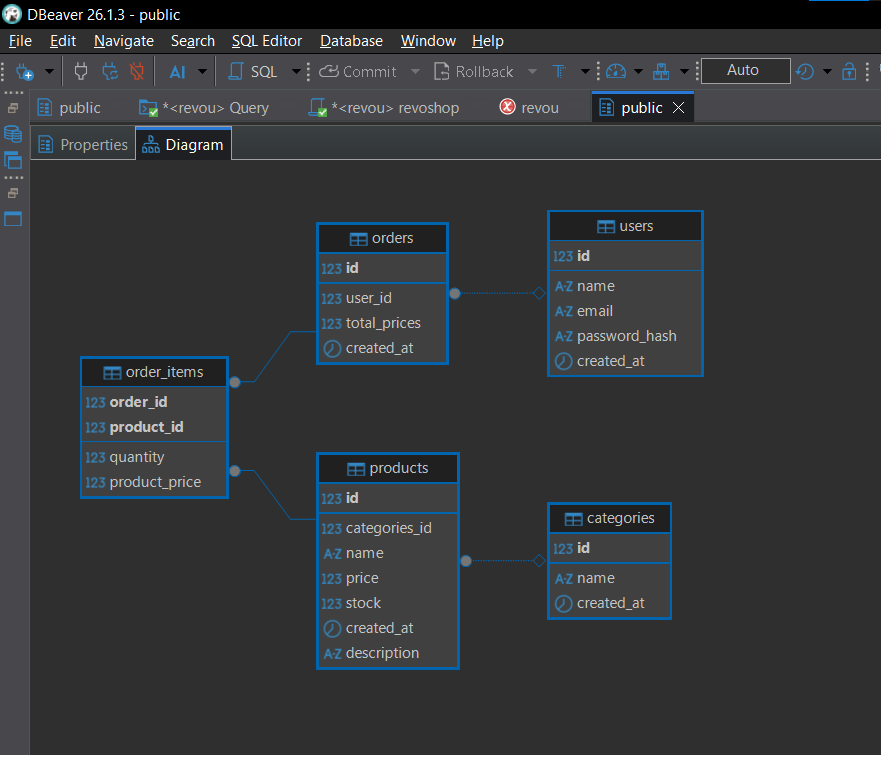
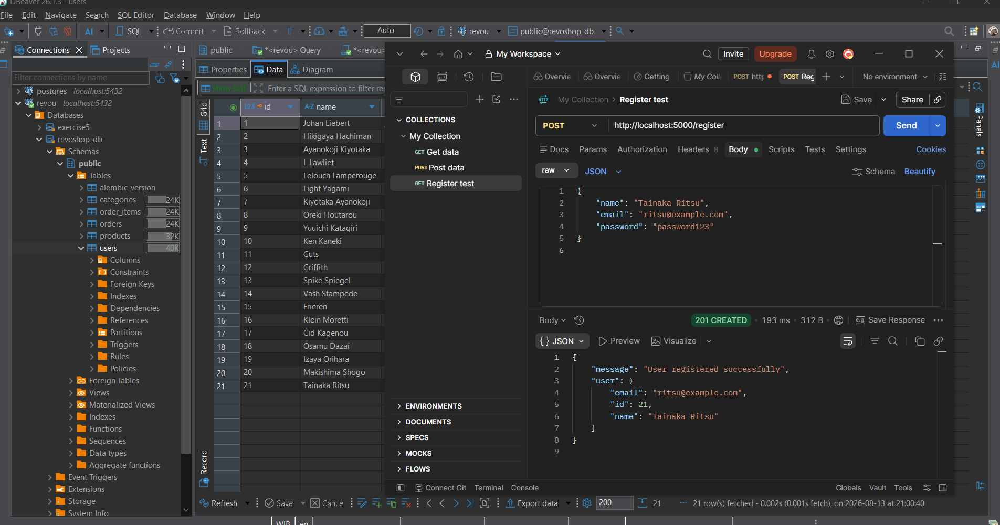
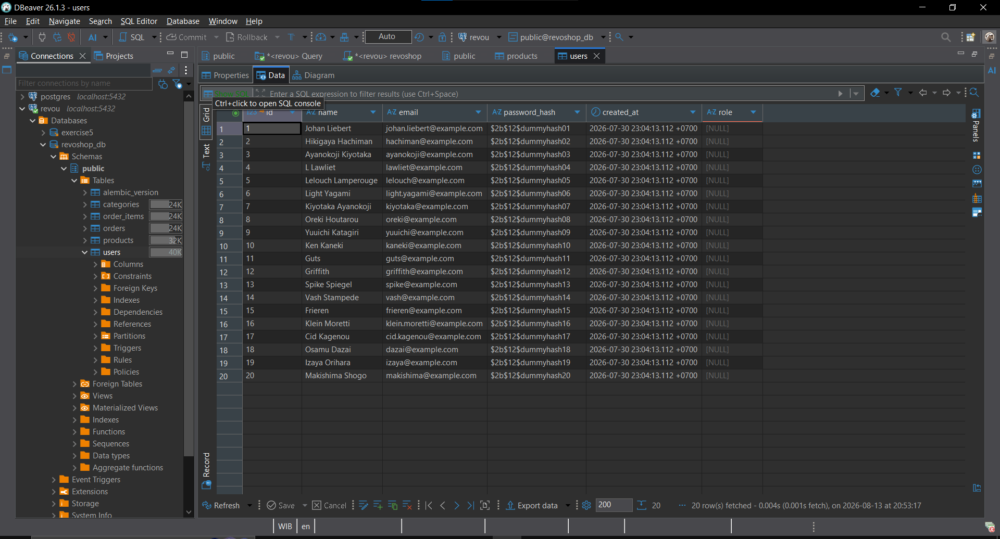

# RevoShop API

Flask REST API with PostgreSQL for managing products, users, and orders.

## Requirements

- Python 3.x
- PostgreSQL
- pgAdmin / DBeaver
- Postman (for API testing)

## How To Run

### 1. Clone repository

```bash
git clone https://github.com/Revou-FSSE-Jun26/module-2-galeriqbal.git
cd module-2-galeriqbal
```

### 2. Install dependencies

```bash
pip install -r requirements.txt
```

### 3. Setup database

Create a `revoshop_db` database in PostgreSQL, then run the SQL files:

```bash
psql -U postgres -d revoshop_db -f revoshop_db/schema.sql
psql -U postgres -d revoshop_db -f revoshop_db/seed.sql
psql -U postgres -d revoshop_db -f revoshop_db/queries.sql
```

### 4. Run migrations

```bash
flask db upgrade
```

### 5. Run the app

```bash
python app.py
```

Server runs at `http://localhost:5000`

## Database Schema



### Tables

| Table | Description |
|-------|-------------|
| users | User data with role column |
| categories | Product categories |
| products | Product data, FK to categories |
| orders | Order data, FK to users |
| order_items | Association table (many-to-many) between orders and products |

## API Endpoints

### GET /

Health check.

**Response:**
```json
{"message": "Flask is connected to PostgreSQL!", "status": "ok"}
```

---

### POST /register

Register a new user.



**Request Body:**
```json
{
    "name": "Test User",
    "email": "test@example.com",
    "password": "password123"
}
```

**Response (201):**
```json
{
    "message": "User registered successfully",
    "user": {
        "id": 21,
        "name": "Test User",
        "email": "test@example.com"
    }
}
```

---

### GET /users/:id

Retrieve a user by ID.

**Response (200):**
```json
{
    "id": 1,
    "name": "Johan Liebert",
    "email": "johan.liebert@example.com",
    "created_at": "2026-08-12T10:00:00+00:00"
}
```

**Response (404):**
```json
{"error": "User not found"}
```

---

### GET /products

Retrieve all products (hardcoded).

**Response (200):** Array of 20 products.

---

### GET /products/:id

Retrieve a product by ID.

**Response (200):**
```json
{
    "id": 1,
    "categories_id": 1,
    "name": "Blade of Despair",
    "price": 10000,
    "stock": 25,
    "description": "Physical Attack tinggi dengan bonus damage saat musuh HP rendah."
}
```

**Response (404):**
```json
{"error": "Product not found"}
```

---

### POST /seed-order

Insert a sample order linked to multiple products (many-to-many demo).

**Response (201):**
```json
{
    "message": "Order created with multiple products (many-to-many)",
    "order_id": 21,
    "products_linked": [1, 6, 18]
}
```

---

### GET /orders/:id

Retrieve an order with its linked products (many-to-many).

**Response (200):**
```json
{
    "order_id": 21,
    "user_id": 1,
    "total_prices": 25500.0,
    "products": [
        {"product_id": 1, "quantity": 1, "product_price": 10000.0},
        {"product_id": 6, "quantity": 1, "product_price": 25000.0},
        {"product_id": 18, "quantity": 1, "product_price": 2400.0}
    ]
}
```

**Response (404):**
```json
{"error": "Order not found"}
```

## Postman Documentation

Full API documentation with examples: [Postman Documentation](https://documenter.getpostman.com/view/57336663/2sBYApxsdU)

## Migration

The `role` column was added to the `users` table using Flask-Migrate:



```bash
flask db migrate -m "add role column to users"
flask db upgrade
```

Migration file: `migrations/versions/83c2828fa2e1_add_role_coloumn_to_users.py`

## Tech Stack

- Flask
- Flask-SQLAlchemy
- Flask-Migrate
- PostgreSQL
- psycopg2-binary

Thank you.
